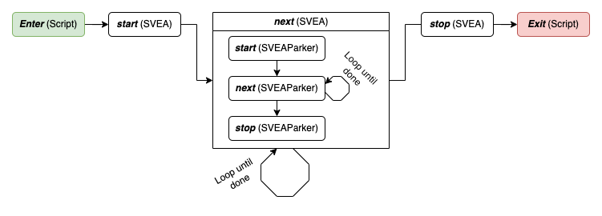

# Automatic Control Project
Group members: Christoffer Ejemyr, Devrat Singh, Gustav Lenart, Sofia Bedoire

Supervisors: Adrian Wiltz, Alexander Johansson

Please note that the code for this implementation is not available publically. If you want to use the code, please contact the authors
# Installation

## Base Repository
The present implementation builds upon the [starter respository](https://github.com/DevratSingh/svea.git) for KTH's Small-Vehicles-for-Autonomy (SVEA) platform

## System Requirements
This library is developed on and intended for systems running:

1. Ubuntu 18.04 (installation tutorial [here](https://ubuntu.com/tutorials/tutorial-install-ubuntu-desktop#1-overview))
2. ROS Melodic (installation instructions [here](http://wiki.ros.org/melodic/Installation/Ubuntu))
3. Python 2.7

Python 2.7 will be made default when you install ROS. An easy way to check if
Python 2.7 is the default version on your system is to open a terminal and run

```bash
python
```

to make sure you see "Python 2.7" appear somewhere in the header of the text
that appears afterwards.

If you do not want to install Ubuntu onto your computer, consider installing a
[virtual machine](https://www.osboxes.org/ubuntu/) or use
[docker](https://docs.docker.com/install/) with Ubuntu 18.04 images.

The installation instructions later on will use `catkin build` instead of
`catkin_make`, so you should also [install catkin tools using apt-get](https://catkin-tools.readthedocs.io/en/latest/installing.html#installing-on-ubuntu-with-apt-get).

If you had a pre-existing ROS Melodic installation, please run:

```bash
sudo apt update
sudo apt upgrade
```

before continuing onto installing the library.

## Installing the ROS library
Start by going to the folder where you want the code to reside.
For example, choose the home directory or a directory for keeping projects in.
Once you are in the chosen directory, use the command:

```bash
git clone -b team3_main https://github.com/KTH-SML/svea_starter
```

to download the library. Then, a new directory will appear called
`./svea_starter`. Go into the directory with command:

```bash
cd svea_starter
```

To install all of the ROS dependencies that you are missing for this library run:

```bash
rosdep install --from-paths src --ignore-src -r -y
```

Finally, compile and link the libraries using:

```bash
catkin build
source devel/setup.bash
rospack profile
```

To make sure the libraries are linked in the future, also call (**you need to replace
`<path-to-svea_starter>` with the file path to whever you cloned "svea_starter", e.g.
`/home/nvidia/svea_starter/devel/setup.bash`**):

```bash
echo "source <path-to-svea_starter>/devel/setup.bash" >> ~/.bashrc
source ~/.bashrc
```

**Note, you only need to do this once.**

## Installing python dependencies
To install the python dependencies of the project navigate to the project root (`<path-to-svea_starter>`) and run:

```bash
pip install -r requirements.txt
```

Finally we are to install the symbolic optimization library CasADi. Depending on your current environment, follow the instructions bellow.

### Local environments
Install CasADi for python by running `pip install casadi` in the terminal. 

### SVEA environment
To install CasADi on in the SVEA environment you need to install it from sources. Run the following from any directory and enter the SVEA password when prompted.

```bash
./<path-to-svea_starter>/utilities/install_casadi.sh
```


# Usage
The following steps would get the implemented solution running in simulation and on the real car.

There is a need for multiple terminals, some for ssh to SVEA and others to run code locally on the laptop. Therefore, we would proceed by referring to these terminals by numbers.

## Simulation


Get the most recent changes
```bash
cd <path-to-svea_starter>
git checkout team3_main
git pull
catkin build
source devel/setup.bash
```
#### Terminal (1)
```bash
roscd svea_core
roslaunch svea_core demo.launch

```
#### Terminal (2)
```bash
roscd svea_core
roslaunch svea_core demo.launch is_laptop:=true 
```
Once a path has been found, in terminal 1, there will be a prompt, simliar to this: `Satisfied with the path from planner 2? [y/n]`. After assessing the said path in *Rviz*, either '*y*' or '*n*' can be given. If '*n*' is entered, another path would be shown when it is available. If '*y*', the car will start following the path towards the current goal.

## On the Real Car

The steps below are based on the assumption that visulization, planner, and controller would be running on the same computer. It is also possible to launch the visualization node on a sperate computer.

#### Terminal (1)
Get the most recent changes
```bash
cd <path-to-svea_starter>
git checkout team3_main
git pull
catkin build
source devel/setup.bash
```

### For visualization
Make sure that you are in the `svea_starter` directory and then use the following command
```bash
. utilities/export_ros_ip.sh
```
Now, you can start the rviz visulization

```bash
roscd svea_core
cd resources/rviz
rviz -d demo_full.rviz
```
### For processes that run on the Laptop
#### Terminal (2)
Go to `svea_starter` directory and again do the following
```bash
. utilities/export_ros_ip.sh
```
The planner, controller and other system modules can be launched to run locally on the laptop as follows
```bash
roslaunch svea_core demo.launch is_laptop:=true 
```
### For processes that run on the SVEA
Start by openning two terminals and make a connection to the SVEA in both of them.

#### Terminal (3) & (4)
```bash
ping svea5.local
ssh -X nvidia@svea5.local
(password: tx2)
```
In **Terminal (3)**, use the following commands to get the most recent changes

```bash
cd svea_starter
git checkout team3_main
git pull
catkin build
source devel/setup.bash
```
In **Terminal (4)**, run `roscore`

All the relevant system nodes are intialized and launched by `demo.launch` and for SVEA, it needs to be given the additional parameters shown below.

Finally, in **Terminal (3)**, use `roslaunch` as follows
```bash
roslaunch svea_core demo.launch is_sim:=false use_rviz:=false
```
***Note***: After launching the above command, you have to unplug and replug the Realsense camera and then re-launch the `demo.launch` with the shown parameters

# Overview of the solution
The solution to the project consists of a Reachability Analysis that checks for feasible parking spots and a Parking Loop that solves all parking tasks. An overview of the solution is shown in the following figure

<p align="center">
  
</p>

The different modules of the solution are described in more detail in the sections below.

# Model
The car is modeled using a Kinematic Bicycle Model, which models the car as only having one front wheel and one back wheel. The Kinematic Bicycle Model is  implemented in 
`bicycle.py`. 

The model contains that states , ,    and  which correspond to the position in x and y direction, the car's heading with respect to the x axis and the velocity respectively. These states are given with reference to the rear axle of the car. The control inputs used by the model are acceleration  and steering angle . 

The model is given by the following equations:


 

,

where  is the distance from the front wheel to the back wheel. 

# Reachability Analysis

## Installation
The backwards reachability analysis for this project was conducted in matlab using three toolboxes: 
1. [LS Toolbox](https://www.cs.ubc.ca/~mitchell/ToolboxLS/)
2. [helperOC](https://github.com/HJReachability/helperOC)
3. [yamlmatlab](https://code.google.com/archive/p/yamlmatlab/)
- (Please use a matlab version > 2019)

Once both toolboxes are installed and added to appropriate path, reachability analysis can begin. 

## How to run it
The objective of the project was to perform three different parking scenarios.
1. Forward parking
2. Parallel parking
3. Reverse parking

For each resepective maneuover there exists a file in the `parkingscenarios` directory named
1. `forward.m`
2. `parallel.m`
3. `reverse.m` 

which corresponds to an analysis for each parking task. 

In order to most efficiently understand running the analysis we will go through the file `forward.m` step by step. The remaining scripts work analogously.
- (This tutorial will not go through the math of backwards reachability analysis. Such queries are referred to documentation in links above.)

## Step by step
___________
### Grid Parameters

Initially we set the grid parameters. This is the set for which the problem is defined. The dimensions of the grid will be dependent on the model that we use. In our case the car has 4 states, so the grid will have 4 dimensions. The 4th dimension is yaw, and therefore it is looped - indicated by 
```matlab
pdDims = 4
```


(NOTE: The scripts `parallell.m` and `backwards.m` only has 3 states due to problems with backwards driving for the 4 dimensional model.)

We then create a grid and store it in a variable `g`
```matlab
g = createGrid(grid_min, grid_max, N, pdDims)
```
The `readYAML` function call yields the necessary information and variables for all the parking tasks.
The `readYAML` function takes in the parking task configuration as a YAML-file so it is necessary for the script to run smoothly that is of the form: 
``` yaml
park_job0:
    type: "parallel"
    marker_pose:
        x: 1.68128836155
        y: -2.61290645599
        yaw: 2.4958951
    spot_dim:
        width: 0.65
        depth: 0.35
    park_obs:
        - [[-3.881443795854093, -0.426440665468931], [3.2185563099441516, 9.973559489503145], [6.768556362843274, 7.623559454485417], [-0.28144374220991253, -2.976440703466892]]
        - [[0.920527637005, -2.97420406342], [1.30842387676, -3.26895570755], [1.53868889809, -2.95675039291], [1.15658175945, -2.67976498604]]
        - [[0.5685562704560745, -4.276440722838402], [2.768556303238629, -1.0764406751546858], [3.418556312924384, -1.5764406826052664], [1.1185562786517131, -4.476440725818634]]

```
### Target
Thereafter we create a target goal. This is the parking spot we want to finish at. The parking dimensions are approximated by a rectangle centered at the given aruco marker.

```matlab
parkingSpot = shapeRectangleByCenter(g,[round(markerpose.x,1);round(markerpose.y,1);0;round(markerpose.yaw-pi,1)],[0.3*2;0.45*2;2*0.1;2*pi/24]);

```
### System Parameters
In this section we define the model as well as constraints on the dynamic system we analyze. The model that was used for respective script is:
1. `forward.m`: 4 dim Bicycle Model
2. `backwards.m`: 3 dim Dubins Car 
3. `parallell.m`: 3 dim Dubins Car

Furthermore we define the grid that we want to perform analysis on.

### Obstacles
In order to include walls and various obstacles that the car should avoid we define these as polygons in the defined grid `g`. 
(In order to account for the fact that the car in the reachability analysis is a single dot we inflate the obstacles accordingly.)

After succesfully creating all necessary polygons the union of these sets is formed. 

### Compute value function

Here we perform the actual computation in order to find the backwards reachable set. 
As the script is running a blue 'blob' will expand and signify the reachable set as time evolves. The commands 
```matlab
HJIextraArgs.visualize.plotData.plotDims = [1 1 0 1]; %plot the BRS for x,y and theta coordinates
HJIextraArgs.visualize.plotData.projpt = [0]; %project at velocity 0 -- get a 3D slice
```
defines how to visualize the set. In this case the grid is defined by 4 dimensions. This can not be plotted, so we take a 3D 'slice' - project the 4D set onto 3D for all points on the grid where velocity is 0. That is where the car stands still. 

The computation is done by the command:
```matlab
[data, tau2, ~] = ...
  HJIPDE_solve(parkingSpot, tau, schemeData, 'none', HJIextraArgs);
```

## If all goes well...
We should get a plot similar to
<p align="center">
  
</p>

Here the green blob is the parking spot and the red polygon represent the parking obstacles.

## Plotting obstacles
_____________________

Before running the analysis, it may be fruitful to look at the parking spot aswell as the corresponding obstacles of the whole map.

This can be done by using the script `viewing_obstacles.m`. This script is intended to be run in segments - each segment for the respective parking task. 
Note that this function takes in all the obstacles of the map from the map also in the form of a YAML file: `obstacles.yaml`

## Great, what's the use?
The intented usage of this script is mainly to understand intuitively and verify which areas the car can start a parking task from. One can select points from the blue blob by simply opening a matlab figure in a window and selecting arbitrary points with the graphical interface. Theoretically all of these points are valid starting configurations for the car, regarding a parking maneouver. 

The group has not created any automatic procedure to find optimal starting configurations and forwarding these to the state machine.

Thus, the way that reachability analysis is used with the scripts is to verify the reachability of arbitrary intermediate points selected on the course map. 

# Planner
## Planner Workflow
<p align="center">
  
</p>

## Info

As you might have noticed, the planning module in this implementation is focused around Rapidly exploring Random Tree (RRT) planning. Mainly, we utilize two separate variations of RRT: 
- 2D RRT, which only considers the (x,y) states when planning
- RRT-Reeds-Shepp, which considers the non-holonomic constraints of the car

When discussing the planning challenges in this work-case, it essentially boils down to long distance planning when the car is moving in-between parking spots and short distance planning when the car parks into the spot. Therefore, we try to handle these two scenarios separately.The planner module decides which type of planning to do based on the straight line distance between start and goal. If the distance is greater than 3m, then long distance planning routine is done, otherwise the short distance scheme runs. 

#### Obstacles
The planner consider obstacles as points with some inflation. So, an obstacle point holds the following information: (x,y,inflation). In RRT, the collision check functionality checks if any waypoint in the path are within the inflation distance of the obstacles. All obstacle points that correspond to the walls have the same inflation and spread relatively far to decrease the total number of points. On the other hand, the parking spots have comparatively lower inflation, but are closely spaced. The difference in inflation between obstacle points is done to avoid completely covering the narrow parking spots.

Given that the collision check considers all the points in the obstacle list, it results in some unnecessary computations as some of these points are completely outside the periphery of the plannable route. Accordingly, to circumvent this, we create the obstacle list based on the start and goal points. For this, it considers the midpoint between the start and goal, and with that as the center a circle is considered that encapsulates the start, goal and and some additional area. Correspondingly, only those obstacle points that are within the mentioned circle gets added to the new obstacle list.

This does not create much difference when planning for long distances, but has considerable effect on the planning speed when dealing with short distances.

#### Short Distance Planning
This case is fairly simple. It is handled by the RRT Reeds-Shepp planner, which as the name suggests considers the Reeds-Shepp car model. This implies that the allowed movement includes both forward and backward motion at a constant speed with non-holonomic constraints. The base structure is identical to that of standard RRT, however, the difference comes in random propagation part of the algorithm. Here, in each iteration of the algorithm, the point is moved based on the constraints provided by Reeds-Shepp planner. Finally, once there is a feasible path between the start and goal, the planner ends and returns the path waypoints which are of the form (x,y,theta).

#### Long Distance Planning
This case for planning is generally performed when the car needs to travel in-between parking spots. Intuitively, a valid question worth asking is why can the short distance planner not handle this scenario as well. Well, we tried that, planning directly with RRT-Reeds-Shepp over long distance becomes a hard task given with such constrain on movements, leading to longer computation time and the zig-zaggy paths. Therefore, to simplify the problem, the non-holonomic constraints were dropped for longer distances. The choice is justified by the consideration that during long distance travel, the car is moving in the forward direction and mostly in a continuous path. However, there is a caveat to this situation, eventhough the car's movements are generally simple over long distances, the endpoints of the journey might need some back and forth maneuvering to achieve the desired heading. 
Consequently, a long distance path is found in stages and they are as follows:
1. Find a simple path with RRT 2D between given start and goal. The result is path waypoints of form (x,y)
2. Find path from start point to next immediate point, with RRT Reeds-Shepp
3. Again, find path from last second point to goal, with RRT Reeds-Shepp
4. For the remaining in-between path points, smoothen using [Bezier curves](https://github.com/torresjrjr/Bezier.py)
5. The smoothened Bezier path points lack heading information. So, for each waypoint a heading is added that points towards the next point
6. Finally, the three different paths are combined, i.e. *Final_path = Start RRT Reeds-Shepp path +  Bezier path + End RRT Reeds-Shepp path*.

#### Need for multiple planners?
Given that we are utlilzing RRT and not any other optimized variant (for faster paths), there are instances, where the obtained path is unreasonable. Such paths would follow the given constraints, but they could be too zig-zaggy or unnecessarily complex. So, to account for this randomness, we have multiple path planner services running simultaneously and then, one can choose between the available paths.

# Controller
## MPC
An MPC controller is used to control the car and make sure that the path from the planner is followed. The MPC controller is implemented in `MPCControllerCasadi.py`.

The MPC controller takes the current true states of the car  as input and finds the control inputs  by minimizing a cost function over horizon . The MPC problem including the cost function that is to be minimized is given by:


^TQ(z_k^{ref}-z_k)+u_k^{T}Ru_k+(v_{inp_k}-v_k)^TG(v_{inp_k}-v_k))+(z_N^{ref}-z_N)^TP(z_N^{ref}-z_N))

subject to


 


In the MPC problem formulation,  corresponds to a state from the reference path given by the planner.

In our implementation, the horizon length  is set by  `self.horizon` and the sampling time  is set by `self._dt` in the initialization of the `MPCControllerCasadi` class in `MPCControllerCasadi.py`. These are currently set to  and  . The cost matrices , ,  and  are set in the `get_matrices` method in `MPCControllerCasadi.py`. 


### Control inputs sent to the actuator
In a perfect world, the MPC only sends the first control inputs  to the actuator at each step. However, to get a smooth movement, the car needs control inputs every  second. If the ongoing MPC optimization is not finished after  seconds, inputs from the previous MPC computation are sent to the actuator instead of waiting for the ongoing MPC to finish.

### Moving horizon 
What reference states to use in the cost function computations depend on where the horizon starts. Each time before computing the cost function, it must be determined at what reference state the horizon should start. This is done by checking the distance  between the true state of the car after applying a control input and all reference states within the current horizon each time. If the true state is close (in position and heading) to one of the reference states, then move the horizon so that the closest reference state is the first reference state for the next cost function computations. However, if the true state is far away from all reference states, minimize the cost function over the same reference states again. The same reference states can be used 5 times before the horizon is moved one step ahead. 

### Interpolation of points
The waypoints (x,y position) from the planner are not uniformly spaced, which can result in an irregular and/or high speed when the MPC tries to follow the reference path. To solve this, the reference points are interpolated before they are sent to the controller to make sure that all points are equally spaced. This is done by adding new points inbetween current points if the distance between them is too large. The desired distance between consecutive points is determined based on what speed we want the car to keep. The reference speed is set by `self.controller_args['speed']` (line 179) in `SVEAParker.py`.


### Issues
Some problems exist with the current implementation:
* The real car only moves when the velocity is > some value. This is not handled in the MPC, so the car can get stuck trying to move with a velocity input so small so that it actually stands still. However, this is often solved after some time when the MPC cost function computation's change to new reference states. 


## PID
A PID speed controller is used to control the velocity. Given a control input velocity from the MPC that we want to keep, the PID speed controller outputs the input velocity that should be sent to the actuator to get the desired velocity. The PID controller is implemented in `PIDController.py`.


# Execution flow and State machines

To control the execution flow as described in the [overview](#overview-of-the-solution) the project implements scripts and state machines that work together to achive the correct execution logic. The machines are fault tolerant and exits cleanly if any unpredicted events occur. A schematic image of the workflow can be found in the image below.

<p align="center">
  
</p>

The choice of state-based logic is easily motivated by the task at hand. During execution the vehicle takes some pre-defined steps to arrive at the destination. These steps, for example planning, following trajectory, waiting, etc., are all very easy to translate into descrete stages (states) during or between which actions are taken.

## Framework
The state machines are implemented using the python package [*transitions*](https://github.com/pytransitions/transitions).

For an introduction to the package we refer to the README.md file of the linked github repo. For this project the following sections will be the most useful:

- [States](https://github.com/pytransitions/transitions#states)
  - [Callbacks](https://github.com/pytransitions/transitions#state-callbacks)
- [Transitions](https://github.com/pytransitions/transitions#transitions)
  - [Conditional transitions](https://github.com/pytransitions/transitions#conditional-transitions)
  - [Callbacks](https://github.com/pytransitions/transitions#transition-callbacks)

## Implementation
As explained in the Usage section the project is run by running the `demo.launch` script. This script launches a python script in which the `SVEA` state machine is loaded. During state execution the `SVEA` machine will create one `SVEAParker` state machine per parking job and iterate through the execution of these tasks.

A printout of all states and transition names are listed below as well as a high level explanation of the execution flow of each state machine is given below. For complete insite on actions taken by the state machine we refer to the code itself located in the [state_machine](src/svea_core/src/svea/state_machine/) folder.

### SVEA state machine
The SVEA state machine is responsible for initializing the SVEAContext and all the environment related things such as reading parameters from the launch files, etc. and to iterate parking over all spots.

Initialization of the environment and reading parking job information is dun during the initialization states and the parking is executed by switching between *to_park*, *parking* and *parked* states.

**States:** *_*, *started*, *initializing*, *initialized*, *to_park*, *parking*, *parked*, *done*, *failed*, *error*

**Transitions:** *start*, *next*, *reset*, *stop*

### SVEAParker state machine
This state machine handles the overall logic of executing a given parking job. When initialized a [ParkingJob](src/svea_core/src/svea/parking_job.py) and an (initialized) [SVEAContext](src/svea_core/src/svea/svea_managers/SVEAContext.py) must be provided, thus this state machine requires some infrastructure outside it and may not be run in isolation.

To execute a parking job the machine iterates the planning and running phases to plan to the next provided point in the ParkingJob. When no more destinations are avalible the state machine exits in a `done` state.

The main notable feature of the implementation is that the planning phase will ask multiple planners to try and find a path to the goal and with the help of human interaction the best path is selected. This communication is handled through ROS services and action services with callback methods upon found paths.

**States:**  *_*, *started*, *planning*, *planned*, *running*, *runned*, *planned_back_out*, *done*, *failed*, *error*

**Transitions:** *start*, *next*, *stop*


## Extend and alter
To alter and/or extend the current execution logic there are multiple approches. This section introduces some of those and adds tips and topics that you will likely find useful.

### New script from scratch
If you would like to start from scratch with a script that has another approach there are a few things to think about that will not be setup yet.

First you need to create a SVEAContext. That will prepare the environment to run both locally and on the real SVEA. Use the configuration in the SVEA state machine as inspiraiton, but it is recomended to use the context with as a propper python context if possible.

### New state machine/alter logic
The most important area to look into for using this method is the transitions library introduced under [Framework](#framework).

Alter the logic by either altering state and transistion logic or by changing the functionality of each callback function in any of the two state machines.

The current infrastructure is built upon the principle that a state machine is run by running some initialization transition (i.e. `start`, `initialize`) and then continously running the `next` transition until the state machine reached a non-running state. This must not be the case, but we encourage you to build this type of structure with new machines since it makes the transition logic very easily visible in the `__init__` method of the state machine.


