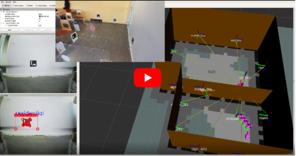
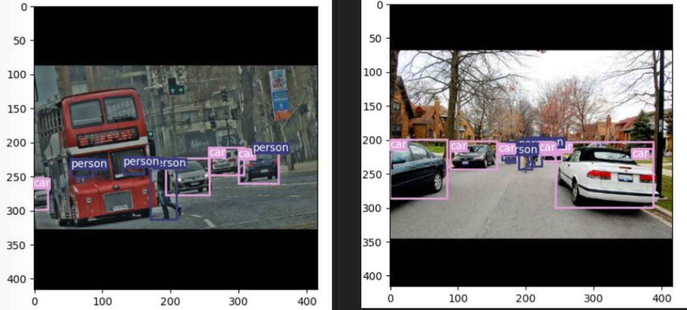
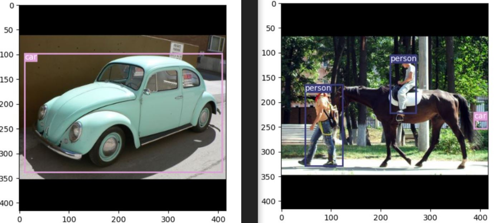
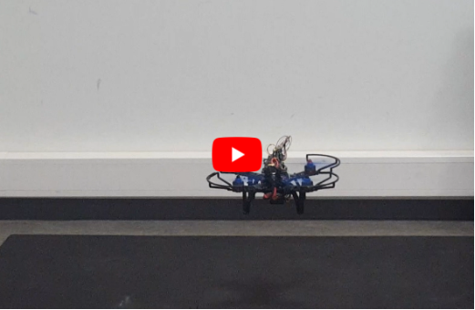
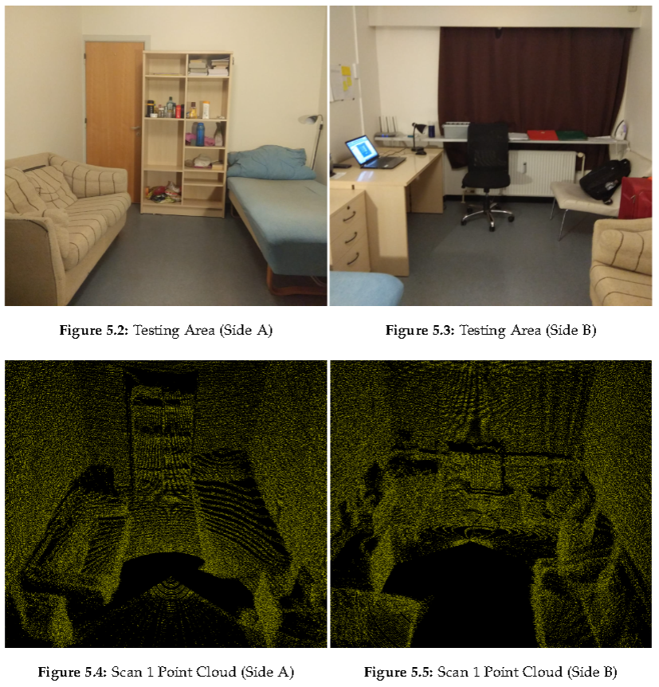
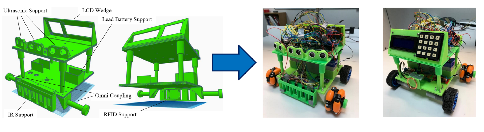

<!--The objective here is to provide a detailed overview of the projects I have taken so far. Most of these projects have links to their respective respositories and documentations (unless priviate). Please bear in mind that some of the projects have been undertaken as a group and I have been responsible for different modules that contribute to the final system. However, I have made a point to also be aware of the intricasies of other components that form the specific system.-->

I have always been keen on the process of system design and implementation, thus, I have made a conscious effort to partake in challenging yet interesting projects. Below are some of those projects. In most of these, I have had the opportunity to be involved in a multitude of roles, from management and research to implementation and testing. The reasoning behind the choice of these endeavors has invariably been flamed by my interest in the said topics, along with the desire to combine the theoretical with the practical.

## Autonomous Exploration of Crazyflie Drone in a Known Environment

The main goal of this project was to allow for a "Crazyflie" drone to autonomously navigate and explore a known environment. The environment is given in terms of a map which contains the positions of walls and landmarks. Accordingly, three main components, namely  Perception, Localization, and Planning are integrated to allow for the system to navigate. The perception part uses a Deep Neural Network (SqueezeNet) to detect and classify the landmarks and then publishes the 6D pose of the perceived landmarks in the map. This is then fed into the localization component, which uses Kalman filter to integrate these measurements in order to provide the current pose of the drone. Finally, the planning part uses the map and the drone location to plan 3D obstacle free paths. An integral part of the planning system is the RRT-based exploration which ensures that all the areas within the map has been explored.

 

This project was implemented using ROS, with the implemented components being gradually tested first on a Gazebo simulation and then finally integrated to test on the real drone.

[System Design Figure](Images/SysDiagph1.png)

[Brief System Design Report](Brief%20System%20Design%20Report%20_Crazyflie%20Project.pdf)

[Link to the Project Git Repository](https://github.com/DevratSingh/Drone-Exploration.git)

 <h4>Exploration through KF localization, Traffic sign detection using CNN and RRT-based exploration</h4> 

<!--- --->

  

## Autonomous Parking for a Non-holonomic vehicle

We began with a challenge: To design and implement a system for a Car to autonomously complete a series of parking tasks and return back to the starting position. The parking spots were placed far apart from each other and each required a specific parking configuration (Parallel, Forward 90 degree, Backward 90 degree). The implementation was intended for <a href="https://raw.githubusercontent.com/DevratSingh/svea/main/media/svea_headshot.jpg">KTH’s SVEA</a>, a non-holonomic vehicle platform. As a base, the initial system came equipped with the map of the test area and a localization module for supplying the Car's estimated location. However, the position and configuration of the parking spots were made aware just before the challenge. Rest of the design choices were left open ended.

The designed solution is outlined by these modules: <a href="https://github.com/DevratSingh/Myprojects/blob/webpage/AutomaticParking.md#model">Car Model</a>, <a href="https://github.com/DevratSingh/Myprojects/blob/webpage/AutomaticParking.md#reachability-analysis">Feasibility Checker</a>, <a href="https://github.com/DevratSingh/Myprojects/blob/webpage/AutomaticParking.md#planner">Path Planner</a>, <a href="https://github.com/DevratSingh/Myprojects/blob/webpage/AutomaticParking.md#controller">Controller</a>, and <a href="https://github.com/DevratSingh/Myprojects/blob/webpage/AutomaticParking.md#implementation">Brain/State machine</a>. The workflow of the system is as follows: First, extract the map and the list of parking spots. Feed the extracted information into the Feasibility checker which performs Backward-Reachability analysis. It means, if it is possible to reach a given parking spot in the desired configuration, then the reachability analysis supplies a set of points from which the Car can reach that spot. After the check, for a particular parking task the Brain module assigns the reachable points as start and goal poses to the path planner. The Planner module based on RRT Reeds Shepp, then outputs a trajectory. Consequently, the MPC (Model Predictive Controller) makes the car follow the trajectory and park in the spot. The whole workflow is then repeated until all the feasible parking tasks are completed.

There are several other intricacies involved in the implemented system, however, it is not possible to describe each of them here. The additional information could be found in the Readme and the presentation slides</a>.

[Presentation: Project Overview](Automatic_Control_Presentation.pdf)

[Project Readme](AutomaticParking.md)

## Detection, Tracking and Quantification of Grooming vs Non-Grooming Behaviour in Mice through Machine Learning

The study of self-grooming behavior of mice on a neural level is important as the mice serve as models for us humans, and this therefore gives us a better understanding of the neuroscience of human behaviors.
Using computer vision based frameworks to study behavior has become increasingly popular, as it allows for efficient analysis of videos displaying certain behavioral patterns.
  In this work we explore the ability to model mice self-grooming behavior using the computer vision based framework DeepLabCut for trajectory extraction in combination with machine learning methods for trajectory classification. 
In particular, the trajectories extracted from using DeepLabCut are annotated and are modeled in a supervised manner using both an LSTM network and a TDA approach.
We show that we are able to accurately distinguish the grooming trajectory sequences from the non-grooming ones which is evident given the evaluation of the LSTM network.

 

[Presenation Slides](Presentation_DD2430.pdf)

[Project Report](Detection_Tracking_and_Quantification_of_Grooming_Non-Grooming.pdf)

<!-- #### Behaviour Tracking and Classification Examples with LSTM and TDA --->

 <h4>Behaviour Tracking and Classification Examples with LSTM and TDA</h4> 

|      LSTM    |         TDA       |
|:-------------:|:------------------:|
|  |  |

## Object Detection with YOLOv3

This project served as an opportunity to gain familiarity with Deep Neural Networks (DNN) and their implementation. A common yet significant problem is object detection and classification, as such, YOLO (You Only Look Once) was chosen for implementation due to its popularity in real-time applications such as autonomous driving. Furthermore, datasets are crucial components of neural networks and accordingly, we chose to work with Pascal VOC and COCO datasets, these being commonly used in image classification and detection scenarios. Moreover, to keep the problem manageable, the network was only trained on two classes (People and Cars) and a subset of images. The network was implemented using PyTorch and trained on GPU using Google Colab and GCP.

 

To make for an inquisitive project, an emphasis was placed on understanding the intricacies such as the effect of each dataset on the result, the size of dataset as well as the type of objects being detected and classified. In particular, a comparison was made on how the network performed on small and large objects in the image.

 

[Project Report](Object%20detection%20with%20YOLOv3.pdf)

[Link to the Project Git Repository](https://gits-15.sys.kth.se/devrat/DD2424project.git)

<!--- #### Results From Network Trained on COCO Dataset --->

 <h4>Results From Network Trained on COCO Dataset</h4> 

<!--- #### Results From Network Trained on VOC Dataset -->

 <h4>Results From Network Trained on VOC Dataset</h4> 

## Bachelor's Thesis (6th Semester): LiDAR-based 2D EKF SLAM

This project expands upon the famous online SLAM problem predominant in the field of robotics, with a focus on wheeled vehicles in indoor environments. The devised solution includes the use of a 2D LiDAR sensor for perception of the surrounding. The a priori pose estimate of the EKF is determined by the velocity motion model. Line features, extracted based on the Split-and-Merge algorithm, are evaluated for possible data associations on the basis of their maximum likelihoods and utilised to compute the a posteriori state estimate. The performance of localization with midpoint enhancement and SLAM algorithms, coded in Python 3, are first assessed in a custom built test environment. Upon the achievements of successful results, efforts towards ROS-based SLAM simulation using the Gazebo tool are put forward.

[Project Report](Bachelor's%20Thesis_LiDAR-based%202D%20EKF%20SLAM.pdf)

<!--- ####  Simulation of EKF Localization with unknown correspondences --->
<!---   --->

<!--- #### Simulation of EKF SLAM with unknown correspondences--->
<!---   --->

<!-- ### Simulation -->

 <h3>Simulation Results</h3> 

|     EKF Localization with unknown correspondences    |         EKF SLAM with unknown correspondences       |
|:-------------:|:------------------:|
|  |  |

## 5th Semester: Quadrotor Attitude and Position Stabilization using PID and LQR

This explores the matter of regulating the attitude and position of a quadrotor employing fundamental techniques of classical and modern control theory. A suitable model retaining only the relevant system dynamics is constructed by adhering to the Newton-Euler technique, while the unknown parameters are identified empirically. On the control side, two methods are put forward: PID and LQR. With the aid of Matlab and Simulink, their performance is assessed in continuous time within the context of stability and reference tracking. Additionally, the PID controller is successfully discretized, simulated and finally implemented on an MCU, allowing the design to be tested on the real setup. The Drone for this project was constructed from scratch by integrating various components such as motors, sensors, MCU etc.

[Project Report](5th%20Semester_Quadrotor%20Attitiude%20and%20Position%20Stabilization.pdf)

<!--- #### Quick flight test of the implemented controllers on the drone constructed for this project -->

 <h4>Quick flight test of the implemented controllers on the drone constructed for this project</h4> 

 <h4>A build montage of the project</h4> 

<!----  --->

  

 

## 4th Semester: Speed Control of a PMDC Motor Using a DC-to-DC Buck Converter

The project focuses on the control of angular speed of a PMDC motor interfaced by a step-down power converter employing fundamental techniques of classical and modern control theory. The system is modeled by retaining only the relevant dynamics and validated following the experimental motor parameter identification and the design of the switching voltage regulator. Four feedback control methods are put forward: PID for speed-only control, cascade PID for speed and current control, pole placement and LQR. Their performances are assessed within the context of stability and reference tracking using Matlab and Simulink. The controllers are then successfully implemented using an MCU, allowing the individual designs to be tested on the real setup. A qualitative analysis is carried out through a testing session that evinces the superiority of modern control design.

[Project Report](4th%20Semester_Speed%20Control%20of%20PMDC%20Motor%20Using%20a%20DC-to-DC%20Buck%20Converter.pdf)

## 3rd Semester: Laser Scanner for 3D Indoor Mapping

This project puts forward a particular solution in the form of a 3D scanning system, which could be utilized for indoor mapping. The system has a microcontroller at its core and integrates a stepper and a servo motor with a LiDAR sensor. Data comprising of distance measurements and angular positioning is processed and then displayed as a point cloud with the aid of MATLAB. The entire system is brought to a working condition and tested in a real environment.

[Project Report](3rd%20Semester_Laser%20Scanner%20for%203D%20Indoor.pdf)

<!-- #### Comparsion of the actual environment vs the scan obtained from our implementation -->

 <h4>Comparsion of the actual environment vs the scan obtained from our implementation</h4> 

 

## 2nd Semester: Line Follower Automated Guided Vehicle for Medical Institutions

This tackled the aspect of developing a prototype device that is capable of autonomously traveling between different points within a map. The system utilizes Arduino to implement and integrate various functionalities. These functionalities include an input system to take user directions, RFID sensor for detecting checkpoints with RFID tags, ultrasonic sensors for obstacle detection and infrared sensors for line following. All these sensors and other system components were housed in a custom built 3D printed structure. In brief, the robot takes input from user in term of destination, it then tries to reach the desired position by following the black lines on the floor while making decisions at intersections.  

[Project Report](2nd%20Semester_Line%20Follower%20Automated%20Guided%20Vehicle%20for%20Medical%20Institutions.pdf)

<!--- #### 3D printed structure for the project and its corresponding CAD model -->

 <h4>3D printed structure for the project and its corresponding CAD model</h4> 

<!--- #### A test of the integrated system --->

 <h4>A test of the integrated system</h4> 

